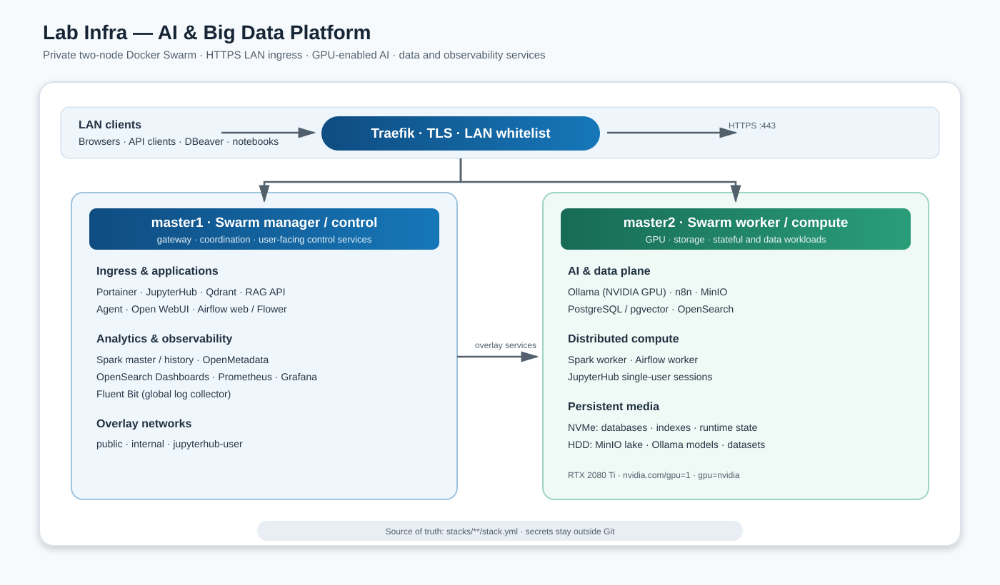
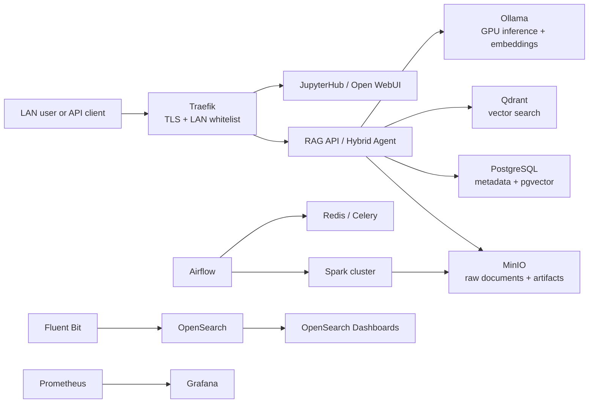

<div align="center">

# Lab Infra — AI & Big Data Platform

**A self-hosted, GPU-enabled AI and data engineering platform running on bare-metal Docker Swarm.**

<p>
  <strong>Platform &amp; runtime</strong><br>
  <a href="https://docs.docker.com/engine/swarm/"></a>
  <a href="https://www.python.org/"></a>
  <a href="https://fastapi.tiangolo.com/"></a>
  <a href="https://github.com/features/actions"></a>
</p>
<p>
  <strong>AI &amp; developer experience</strong><br>
  <a href="https://ollama.com/"></a>
  <a href="https://jupyter.org/hub"></a>
  <a href="https://qdrant.tech/"></a>
  <a href="https://www.langchain.com/langgraph"></a>
  <a href="https://github.com/open-webui/open-webui"></a>
</p>
<p>
  <strong>Data &amp; orchestration</strong><br>
  <a href="https://www.postgresql.org/"></a>
  <a href="https://opensearch.org/"></a>
  <a href="https://min.io/"></a>
  <a href="https://spark.apache.org/"></a>
  <a href="https://airflow.apache.org/"></a>
  <a href="https://n8n.io/"></a>
</p>
<p>
  <strong>Networking &amp; observability</strong><br>
  <a href="https://traefik.io/traefik/"></a>
  <a href="https://prometheus.io/"></a>
  <a href="https://grafana.com/"></a>
  <a href="https://www.nvidia.com/en-us/geforce/graphics-cards/20-series/rtx-2080-ti/"></a>
  <a href="https://github.com/fluent/fluent-bit"></a>
</p>
<p>
  <a href="#license"></a>
  <a href="https://github.com/oscargbocanegra/lab-infra-ia-bigdata/actions"></a>
</p>

</div>

## Table of contents

1. [What this project is](#what-this-project-is)
2. [Why it exists](#why-it-exists)
3. [Architecture at a glance](#architecture-at-a-glance)
4. [What is included](#what-is-included)
5. [How the platform works](#how-the-platform-works)
6. [Prerequisites](#prerequisites)
7. [Getting started](#getting-started)
8. [Using the platform](#using-the-platform)
9. [Repository guide](#repository-guide)
10. [Operations and troubleshooting](#operations-and-troubleshooting)
11. [Security model](#security-model)
12. [Project status and limitations](#project-status-and-limitations)
13. [Contributing](#contributing)
14. [License](#license)

## What this project is

Lab Infra is a reproducible platform for building and operating AI and Big Data workloads on a small physical cluster. It combines local LLM inference, retrieval-augmented generation, vector search, notebooks, workflow orchestration, distributed Spark processing, object storage, data governance, and observability in one coherent environment.

The repository contains the deployable Docker Swarm stacks, application code, host configuration references, tests, runbooks, architecture decisions, and operational scripts needed to run the lab. The `stack.yml` files are the executable source of truth; documentation explains their contracts and operational boundaries.

## Why it exists

Most AI examples stop at a notebook or a single container. This project explores the engineering work required around the model: persistent data, reproducible deployment, GPU scheduling, service-to-service networking, quality checks, logging, dashboards, backups, and safe operations.

It is designed for:

- experimenting with local and private AI systems;
- prototyping RAG and agent applications against real data services;
- learning production-style data platform patterns on modest hardware;
- testing infrastructure, observability, and automation decisions before moving to larger environments.

## Architecture at a glance



### Two-node responsibility split

| Node | Role | Main workloads |
|---|---|---|
| Portainer | `https://aifabric.portainer` | Docker Swarm administration |
| n8n | `https://aifabric.n8n` | Workflow automation |
| Airflow Flower | `https://aifabric.airflow-flower` | Celery task monitoring |
| Prometheus | `https://aifabric.prometheus` | Metrics and alerting UI |
| Qdrant | `https://aifabric.qdrant` | Vector database API and console |
| MinIO Console | `https://aifabric.minio/login` | Object-storage console |
| MinIO S3 API | `https://aifabric.minio-api` | Object storage API |
| OpenMetadata | `https://aifabric.openmetadata` | Data catalog, lineage and quality |
| Spark Master | `https://aifabric.spark-master` | Cluster and application UI |
| Spark Worker | `https://aifabric.spark-worker` | Worker status UI |
| Spark History | `https://aifabric.spark-history` | Completed Spark applications |
| Traefik | `https://aifabric.traefik/dashboard/` | Gateway dashboard (BasicAuth) |
| `master1` | Swarm manager / control plane | Traefik, Portainer, JupyterHub, RAG and agent APIs, Open WebUI, Qdrant, Airflow control, Spark master/history, OpenMetadata, Prometheus, Grafana, Dashboards |
| `master2` | Swarm worker / compute and data plane | PostgreSQL/pgvector, n8n, Ollama, MinIO, OpenSearch, Spark worker, Airflow worker, JupyterHub single-user sessions, GPU exporter |

External traffic enters through Traefik on `master1` over HTTPS. The `public`, `internal`, and `jupyterhub-user` overlay networks separate ingress from backend traffic.

### Request and data flow



## What is included

| Capability | Components |
|---|---|
| Secure ingress | Traefik 2.11, TLS, LAN whitelist, BasicAuth middlewares |
| AI inference | Ollama on NVIDIA GPU, Open WebUI, JupyterHub |
| RAG and agents | FastAPI RAG API, Qdrant, LangGraph hybrid agent, PostgreSQL/pgvector |
| Data platform | MinIO S3-compatible storage, Spark 3.5, Delta Lake configuration, Medallion conventions |
| Orchestration | Airflow 2.9 CeleryExecutor, Redis, n8n |
| Governance | OpenMetadata server, MySQL, catalog connectors, validation DAGs |
| Observability | Fluent Bit, OpenSearch 2.19, Prometheus, Grafana, cAdvisor, node-exporter, NVIDIA exporter |
| Operations | Swarm Secrets, host checks, reboot diagnostics, cleanup and backup scripts |

The repository currently declares 18 stacks and 34 service definitions. `airflow_init` is intentionally configured with zero replicas and is used only for initialization tasks.

## How the platform works

1. A user reaches an internal `aifabric.<servicio>` hostname. DNS or `/etc/hosts` points it to `master1`.
2. Traefik terminates TLS, checks the LAN allowlist and applies service-specific authentication.
3. Application services use the `internal` overlay network to reach databases, object storage, vector search and Ollama.
4. Airflow schedules data and evaluation workflows. Spark processes data on the master/worker pair and stores objects in MinIO.
5. Fluent Bit collects Docker and host-health logs into OpenSearch; Prometheus scrapes node, container, Traefik and GPU metrics for Grafana.

JupyterHub is the only supported Jupyter entry point. It keeps the Hub on `master1` and creates single-user services dynamically on `master2`; the retired standalone Jupyter stack must not be redeployed.

## Prerequisites

### Hardware and host requirements

- Two Linux hosts named `master1` and `master2` joined to one Docker Swarm.
- `master1` as manager/leader; `master2` as worker with `tier=compute`, `storage=primary`, `gpu=nvidia`.
- NVIDIA driver, NVIDIA Container Toolkit and one registered Swarm generic resource (`nvidia.com/gpu=1`) on `master2`.
- Persistent mounts available before Docker starts: `/srv/fastdata` and `/srv/datalake`.
- LAN DNS or `/etc/hosts` entries for the internal `aifabric.<servicio>` names.

### Software

- Docker Engine and Docker Compose/Swarm CLI.
- Git, Bash and access to the container registries used by the stacks.
- Optional: Python 3.11+ for local tests and application development.

Do not commit passwords, certificates, API keys or model credentials. Create them as Docker Swarm Secrets on the manager.

## Getting started

The commands below are a safe deployment outline. The service runbooks contain the exact secret names, host paths and verification steps for your environment.

```bash
# 1. Clone and enter the repository
git clone <repository-url>
cd lab-infra-ia-bigdata

# 2. Confirm the target branch and inspect the stacks
git switch main
rg --files stacks -g 'stack.yml'

# 3. Create external overlay networks (once, on the Swarm manager)
docker network create --driver overlay --attachable public
docker network create --driver overlay --attachable internal
docker network create --driver overlay --attachable jupyterhub-user

# 4. Create the required Swarm Secrets outside Git
docker secret ls

# 5. Deploy in dependency order
docker stack deploy -c stacks/core/00-traefik/stack.yml traefik
docker stack deploy -c stacks/core/01-portainer/stack.yml portainer
docker stack deploy -c stacks/core/02-postgres/stack.yml postgres
# Then deploy data, AI/ML, automation and monitoring stacks as documented.

# 6. Inspect convergence
docker stack ls
docker stack services <stack>
docker node ls
```

For a complete preflight and acceptance sequence, use [`docs/architecture/Checklist_Infra_Lab.md`](docs/architecture/Checklist_Infra_Lab.md).

## Using the platform

### Web interfaces

After configuring internal DNS/hosts and credentials, the primary endpoints are:

| Interface | URL | Purpose |
|---|---|---|
| Portainer | `https://aifabric.portainer` | Docker Swarm administration |
| n8n | `https://aifabric.n8n` | Workflow automation |
| Airflow Flower | `https://aifabric.airflow-flower` | Celery task monitoring |
| Prometheus | `https://aifabric.prometheus` | Metrics and alerting UI |
| Qdrant | `https://aifabric.qdrant` | Vector database API and console |
| MinIO Console | `https://aifabric.minio/login` | Object-storage console |
| MinIO S3 API | `https://aifabric.minio-api` | Object storage API |
| OpenMetadata | `https://aifabric.openmetadata` | Data catalog, lineage and quality |
| Spark Master | `https://aifabric.spark-master` | Cluster and application UI |
| Spark Worker | `https://aifabric.spark-worker` | Worker status UI |
| Spark History | `https://aifabric.spark-history` | Completed Spark applications |
| Traefik | `https://aifabric.traefik/dashboard/` | Gateway dashboard (BasicAuth) |
| JupyterHub | `https://aifabric.jupyterhub` | Multi-user notebooks and experiments |
| Open WebUI | `https://aifabric.chat` | Conversational UI for Ollama and knowledge workflows |
| RAG API | `https://aifabric.rag-api/docs` | Document ingestion and retrieval API |
| Hybrid Agent | `https://aifabric.agent/docs` | RAG + SQL agent API |
| Ollama | `https://aifabric.ollama` | LAN-protected model API |
| Airflow | `https://aifabric.airflow` | DAG scheduling and execution |
| Grafana | `https://aifabric.grafana` | Metrics dashboards |
| OpenSearch Dashboards | `https://aifabric.dashboards` | Logs and search |
| MinIO | `https://aifabric.minio` | Object-storage console |

### API examples

```bash
# List available Ollama models (self-signed TLS in the lab)
curl -k -u "$OLLAMA_USER:$OLLAMA_PASSWORD" \
  https://aifabric.ollama/api/tags

# Check the RAG API
curl -k https://aifabric.rag-api/health

# Check the JupyterHub health endpoint
curl -k https://aifabric.jupyterhub/hub/health
```

### Data workflows

- Land raw objects in MinIO `bronze/`.
- Use Spark and Airflow to validate and promote data to `silver/` and `gold/`.
- Store relational metadata and audit information in PostgreSQL.
- Use Qdrant for semantic retrieval and Ollama for embeddings and generation.
- Explore data from a JupyterHub session or consume APIs through Open WebUI and the Agent.

## Repository guide

### Start here

| Document | When to read it |
|---|---|
| [`docs/architecture/ARCHITECTURE.md`](docs/architecture/ARCHITECTURE.md) | Understand system boundaries and flows |
| [`docs/architecture/SERVICES.md`](docs/architecture/SERVICES.md) | Find every stack, service and endpoint |
| [`docs/architecture/NODES.md`](docs/architecture/NODES.md) | Understand placement, labels and GPU scheduling |
| [`docs/architecture/NETWORKING.md`](docs/architecture/NETWORKING.md) | Configure domains, networks and ports |
| [`docs/architecture/STORAGE.md`](docs/architecture/STORAGE.md) | Prepare disks and persistent paths |
| [`docs/architecture/DATABASES.md`](docs/architecture/DATABASES.md) | Understand databases, users and access patterns |
| [`docs/architecture/STATE.md`](docs/architecture/STATE.md) | Check the declared/current operational state |

### By task

- **Deploy or recover a service:** [`docs/runbooks/`](docs/runbooks/)
- **Operate JupyterHub:** [`docs/runbooks/JUPYTERHUB_SWARM.md`](docs/runbooks/JUPYTERHUB_SWARM.md)
- **Operate GPU inference:** [`docs/runbooks/runbook_ollama.md`](docs/runbooks/runbook_ollama.md)
- **Operate Spark and Airflow:** [`docs/runbooks/runbook_spark.md`](docs/runbooks/runbook_spark.md), [`docs/runbooks/runbook_airflow.md`](docs/runbooks/runbook_airflow.md)
- **Operate storage and databases:** [`docs/runbooks/runbook_minio.md`](docs/runbooks/runbook_minio.md), [`docs/runbooks/runbook_postgres.md`](docs/runbooks/runbook_postgres.md), [`docs/runbooks/runbook_opensearch.md`](docs/runbooks/runbook_opensearch.md)
- **Investigate reboots and cleanup:** [`docs/runbooks/REBOOT_DIAGNOSTICS.md`](docs/runbooks/REBOOT_DIAGNOSTICS.md), [`docs/runbooks/DOCKER_CONTAINER_CLEANUP.md`](docs/runbooks/DOCKER_CONTAINER_CLEANUP.md)
- **Understand decisions:** [`docs/adrs/`](docs/adrs/) and [`docs/adrs/README.md`](docs/adrs/README.md)
- **See planned work:** [`docs/ROADMAP.md`](docs/ROADMAP.md)

### Repository layout

```text
stacks/       Deployable Swarm stacks grouped by domain
app code/     RAG API and hybrid-agent services under stacks/ai-ml
docs/         Architecture, ADRs and operational runbooks
scripts/      Diagnostics, hardening, verification and maintenance
tests/        Application tests (RAG API and agent)
notebooks/    Demonstrations and integration experiments
envs/         Non-secret environment templates
secrets/      Local secret inputs; never commit their contents
```

## Operations and troubleshooting

Use the service-specific runbook before changing a stateful stack. Common checks:

```bash
docker node ls
docker stack services <stack>
docker service ps <stack>_<service> --no-trunc
docker service logs <stack>_<service> --tail 100
docker network inspect public
docker secret ls
```

If a service is unhealthy, check placement constraints, mounted disks, secret names, overlay-network membership and the image digest before forcing a restart. For stateful services, take or verify a backup before removing a task or volume.

## Security model

- LAN-only exposure through Traefik; no public Internet ingress is required.
- TLS terminates at Traefik. The lab uses an internal/self-signed certificate unless you provide another certificate.
- BasicAuth and LAN allowlists protect administrative and API routes.
- Credentials and private keys are Docker Swarm Secrets, not Git files.
- OpenSearch runs single-node with its security plugin disabled; perimeter controls and network isolation are intentional lab trade-offs. Review [ADR-004](docs/adrs/ADR-004-opensearch-security-plugin-disabled.md) before changing this.
- GPU and Docker socket access are privileged capabilities and should remain constrained to the services that need them.

This is a private laboratory platform, not a hardened multi-tenant production service.

## Project status and limitations

The repository describes the current Swarm topology and deployable stacks. Runtime health is environment-dependent and must be verified with `docker node ls` and `docker stack services`; documentation does not imply that every host is running at all times.

Known boundaries include single-node stateful services, local disks, LAN-only DNS, self-signed TLS by default, and no automatic cross-node replication for every dataset. See [`docs/architecture/STATE.md`](docs/architecture/STATE.md) and [`docs/ROADMAP.md`](docs/ROADMAP.md).

## Contributing

1. Create a focused branch from `main`.
2. Change the stack and its relevant README/runbook together.
3. Run the applicable tests and `git diff --check`.
4. Update an ADR when a change alters an architectural decision.
5. Open a pull request with deployment impact, rollback steps and verification evidence.

## License

No license file is currently declared in this repository. Treat the contents as project-specific until a license is added.
