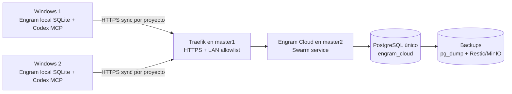

# Engram en el clúster

## Arquitectura



Engram mantiene una base SQLite local por instalación/usuario. El cloud en
`master2` es la réplica central y PostgreSQL es su almacenamiento persistente.
Codex no usa MCP por red: lanza `engram mcp` localmente por stdio.

## Inventario

- PostgreSQL para Engram: una base `engram_cloud` dentro del servicio
  PostgreSQL existente en `master2`; no es un PostgreSQL separado.
- Engram Cloud: una réplica Swarm en `master2`.
- SQLite: una base local por nodo/usuario que ejecute Engram. En los dos
  Windows hay, como mínimo, una `~/.engram/engram.db` por usuario. El clúster
  no monta esas SQLite: solo recibe sus cambios mediante HTTPS.
- Backups: dump lógico de `engram_cloud` y copia mediante Restic de los dumps.

## Manual Windows

1. Instalar Engram y Git Bash/SQLite si se requiere reparación legacy.
2. Instalar la CA pública `clients/windows/aifabric-lab-root-ca-v2.crt` en
   `Cert:\CurrentUser\Root`.
3. Configurar `ENGRAM_CLOUD_AUTOSYNC=1`,
   `ENGRAM_CLOUD_SERVER=https://aifabric.engram` y el token en el almacén
   seguro del usuario. No guardar tokens en Git ni capturas.
4. Para cada nombre autorizado, ejecutar `engram cloud enroll <proyecto>` y
   después `engram sync --cloud --project <proyecto>`.
5. Si el diagnóstico reporta payload legacy, ejecutar `doctor`, luego
   `upgrade repair --apply`; usar el helper de sesiones solo cuando el doctor
   indique que falta `session.directory`.
6. Reiniciar Codex para que su proceso MCP herede el entorno. La configuración
   MCP sigue siendo local:

   ```toml
   [mcp_servers.engram]
   command = "engram"
   args = ["mcp", "--tools=agent"]
   ```

## DBeaver

DBeaver se conecta a PostgreSQL, no a la API Engram. Crear un túnel SSH:

```powershell
ssh -N -L 15432:127.0.0.1:5432 master2-jupyterhub
```

Parámetros PostgreSQL: host `127.0.0.1`, puerto `15432`, base
`engram_cloud`, usuario `engram` y la contraseña del secreto Swarm
`pg_engram_pass`. Mantener el túnel abierto y no publicar el puerto 5432 en
la red de usuarios.

## Operación y seguridad

- El allowlist del servidor es explícito; no usar `*` en producción.
- Un token gestionado por Windows/usuario es preferible al token heredado
  compartido.
- Respaldar PostgreSQL antes de cambios y probar restauraciones.
- Conservar la clave privada de la CA fuera de Git, cifrada y con permisos
  `600` en `master1`.
