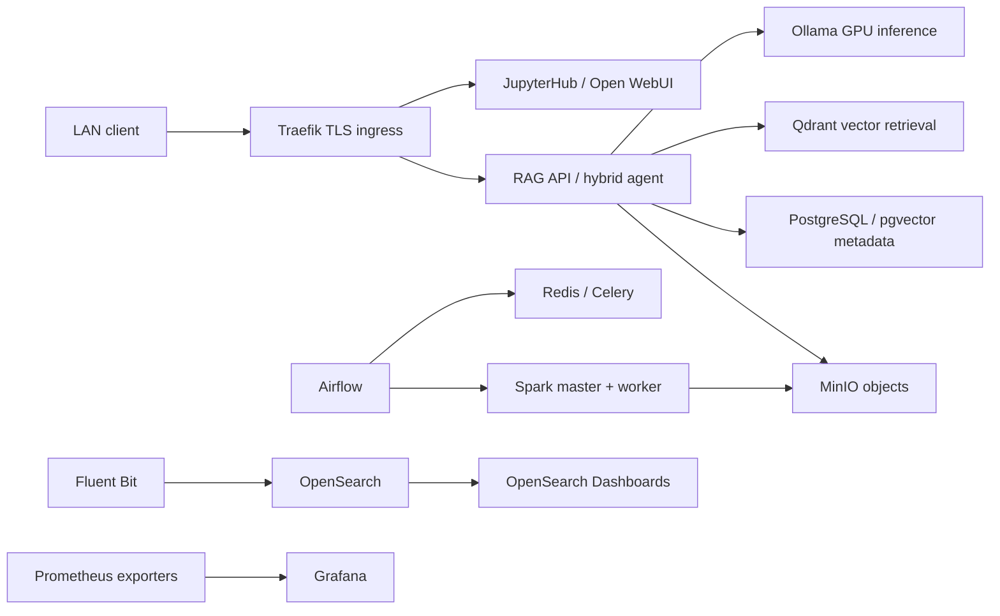

# Lab Infra — S3.11 technical case study

> A production-oriented, self-hosted AI and data engineering laboratory running on bare-metal Docker Swarm.
>
> This repository is a technical case study for integrated AI, RAG, agent, data-engineering, and observability workloads. It documents a private lab, not a hardened multi-tenant production service.

## 1. Executive technical summary

Lab Infra is a private two-node Docker Swarm platform for running integrated AI and data-engineering workloads on physical hosts. The repository contains executable stacks, application code, tests, host references, runbooks, ADRs, diagnostics, and CI/CD workflows.

The platform joins a Traefik ingress path with local GPU inference, RAG and agent APIs, vector and relational data services, object storage, Spark processing, Airflow orchestration, governance, logging, and metrics. The deployable stack files are the technical source of truth; this case study summarizes what can be traced to those files.

**Portfolio handoff**

- **Title:** Lab Infra — AI & Big Data Platform
- **Summary:** Private, self-hosted AI and data-engineering laboratory integrating local LLM inference, RAG, agent workflows, distributed processing, governance, and observability on Docker Swarm.
- **Architecture image:** [`docs/architecture/architecture-overview.svg`](architecture/architecture-overview.svg)
- **Repository:** [github.com/oscargbocanegra/lab-infra-ia-bigdata](https://github.com/oscargbocanegra/lab-infra-ia-bigdata)
- **Direct evidence:** [`stacks/`](../stacks/), [`docs/architecture/`](architecture/), [`docs/adrs/`](adrs/), [`tests/`](../tests/), [CI workflow](../.github/workflows/ci.yml), [deployment workflow](../.github/workflows/deploy.yml)

## 2. Engineering challenge

The engineering challenge is to operate more than an isolated notebook or model container: local inference, retrieval, agent orchestration, persistent data, distributed processing, workflow scheduling, governance, and observability must coexist on a small physical cluster. The repository addresses this by making placement, networks, storage, secrets, health checks, runbooks, and rollback-oriented operations explicit in versioned artifacts.

## 3. Constraints

- Two bare-metal Swarm nodes: `master1` as manager/leader and `master2` as worker with compute, storage, and GPU labels. See [`docs/architecture/NODES.md`](architecture/NODES.md).
- Host-local persistent paths and a shared LAN-oriented ingress model. See [`docs/architecture/STORAGE.md`](architecture/STORAGE.md) and [`docs/architecture/NETWORKING.md`](architecture/NETWORKING.md).
- External Swarm overlay networks and external Docker Swarm Secrets are prerequisites; secret values are not committed.
- Stateful services are primarily single-node, and runtime health must be verified in the target environment.
- The repository is a private lab. It does not claim customer delivery, SaaS operation, multi-tenant isolation, enterprise certification, benchmark results, or ROI.

## 4. Architecture overview

The executable topology is split by node responsibility:

| Plane | Evidence-backed responsibilities |
|---|---|
| Ingress and control (`master1`) | Traefik, Portainer, JupyterHub, RAG and agent APIs, Open WebUI, Qdrant, Airflow control services, Spark master/history, OpenMetadata, OpenSearch Dashboards, Prometheus, Grafana, and Fluent Bit placement. |
| Compute and data (`master2`) | PostgreSQL/pgvector, n8n, Ollama with the declared GPU resource, MinIO, OpenSearch, Spark worker, Airflow worker, dynamic JupyterHub single-user sessions, and node-level telemetry. |
| Network boundaries | External `public`, `internal`, and `jupyterhub-user` overlays plus Swarm `ingress`; exact declarations are in the relevant `stack.yml` files and [`docs/architecture/NETWORKING.md`](architecture/NETWORKING.md). |

The inventory and current service contracts are maintained in [`docs/architecture/SERVICES.md`](architecture/SERVICES.md). The architecture diagram is a presentation of that repository-backed topology, not a runtime availability assertion.

## 5. Request and data flow

The flow is supported by the RAG API database adapters and routers in [`stacks/ai-ml/04-rag-api/`](../stacks/ai-ml/04-rag-api/), the agent graph in [`stacks/ai-ml/06-agent/`](../stacks/ai-ml/06-agent/), Airflow DAGs in [`stacks/automation/03-airflow/dags/`](../stacks/automation/03-airflow/dags/), and the monitoring stacks in [`stacks/monitoring/`](../stacks/monitoring/).

## 6. Key architecture decisions

| Decision | Rationale | Trade-off | Operational consequence | Evidence |
|---|---|---|---|---|
| Docker Swarm over Kubernetes | Keep orchestration aligned with a small two-node Docker lab. | Fewer orchestration primitives and no native autoscaling. | Placement, external networks, and stack deployment remain explicit. | [ADR-001](adrs/ADR-001-docker-swarm-vs-kubernetes.md) |
| `master1` as the sole LAN gateway | Concentrate HTTPS routing and internal hostname entry at one control-plane node. | Gateway responsibility is concentrated on one node. | Traefik routes service labels and applies the documented ingress controls. | [ADR-002](adrs/ADR-002-master1-unico-gateway.md), [`stacks/core/00-traefik/`](../stacks/core/00-traefik/) |
| GPU generic resource on `master2` | Make GPU placement explicit for local inference. | One declared GPU limits practical concurrency. | Ollama is constrained to the compute node and the declared Swarm resource. | [ADR-005](adrs/ADR-005-gpu-generic-resources-swarm.md), [`stacks/ai-ml/02-ollama/stack.yml`](../stacks/ai-ml/02-ollama/stack.yml) |
| Qdrant plus PostgreSQL/pgvector | Separate primary vector retrieval from relational metadata and SQL paths. | More stateful services and operational surface. | RAG services carry separate vector, metadata, and object-storage dependencies. | [ADR-009](adrs/ADR-009-qdrant-vs-pgvector.md), [`stacks/ai-ml/04-rag-api/app/db/`](../stacks/ai-ml/04-rag-api/app/db/) |
| OpenSearch security plugin disabled in the private lab | Preserve the documented lab integration behind Traefik and LAN controls. | Not suitable as a generalized security posture for broader exposure. | Reassessment is required before sensitive-data or public exposure. | [ADR-004](adrs/ADR-004-opensearch-security-plugin-disabled.md), [`stacks/data/11-opensearch/stack.yml`](../stacks/data/11-opensearch/stack.yml) |

Where a future improvement is desirable but not implemented, it remains a recommendation rather than an existing capability. Examples include active alert routing and restore-drill evidence in [`docs/PRODUCTION_READINESS.md`](PRODUCTION_READINESS.md).

## 7. Capability map

| Capability | Implemented repository evidence |
|---|---|
| Secure ingress | Traefik TLS routes, LAN allowlisting, and service-specific authentication labels in [`stacks/core/00-traefik/`](../stacks/core/00-traefik/) and service stacks. |
| AI inference and interaction | Ollama, Open WebUI, and JupyterHub in [`stacks/ai-ml/`](../stacks/ai-ml/). |
| RAG and agents | FastAPI RAG API, Qdrant, PostgreSQL/pgvector adapters, MinIO integration, and LangGraph agent code. |
| Data processing | Spark, Delta configuration, Airflow DAGs, and Bronze/Silver/Gold conventions in [`docs/architecture/MEDALLION.md`](architecture/MEDALLION.md). |
| Workflow automation | Airflow with Celery/Redis and n8n stack definitions. |
| Governance | OpenMetadata stack and connectors, plus governance validation DAGs. |
| Observability | Fluent Bit to OpenSearch/Dashboards and Prometheus exporters to Grafana. |
| Operations | Runbooks, diagnostics, hardening and backup scripts, tests, and CI/CD workflows. |

## 8. Operational model

The repository treats `stack.yml` files as deployable contracts. Operators prepare external networks, Swarm Secrets, host mounts, node labels, and GPU prerequisites, then deploy in dependency order and verify convergence with Swarm commands. Service-specific procedures, recovery steps, and troubleshooting are in [`docs/runbooks/`](runbooks/), with a preflight and acceptance checklist in [`docs/architecture/Checklist_Infra_Lab.md`](architecture/Checklist_Infra_Lab.md).

CI runs lint and application tests on GitHub-hosted runners; the deploy workflow builds and deploys selected custom images from a protected self-hosted runner after the repository's documented controls. These workflow definitions are evidence of the automation pattern, not proof that the current runtime is healthy.

## 9. Security model

The documented model is for a private lab:

- LAN-oriented ingress through Traefik with TLS and allowlisting.
- BasicAuth or service credentials where declared by the stack.
- Docker Swarm Secrets for credentials and private keys; values remain outside Git.
- `public`, `internal`, and `jupyterhub-user` network boundaries.
- Explicit acknowledgement that OpenSearch runs with its security plugin disabled and that the default certificate model is internal/self-signed unless replaced.

The repository does not claim Zero Trust, enterprise-grade security, certification, centralized identity, unified authorization, or hardened multi-tenant isolation. See [`docs/PRODUCTION_READINESS.md`](PRODUCTION_READINESS.md) and [ADR-004](adrs/ADR-004-opensearch-security-plugin-disabled.md).

## 10. Observability

Fluent Bit is declared as a global service for Docker and host-health logs, forwarding to OpenSearch and its dashboards. Prometheus is configured with node-exporter, cAdvisor, and NVIDIA exporter targets, while Grafana provisions the declared dashboards. The repository supports an observability path; actual target health, ingestion, retention, and dashboard freshness require runtime verification.

Evidence: [`stacks/monitoring/00-fluent-bit/`](../stacks/monitoring/00-fluent-bit/), [`stacks/monitoring/01-prometheus/`](../stacks/monitoring/01-prometheus/), [`stacks/monitoring/02-grafana/`](../stacks/monitoring/02-grafana/), and [`docs/runbooks/runbook_opensearch.md`](runbooks/runbook_opensearch.md).

## 11. Production-oriented patterns demonstrated

The repository demonstrates patterns that are useful when moving toward production: versioned deployment contracts, explicit placement, externalized secrets, TLS ingress, health checks, persistent-storage documentation, backup/hardening scripts, application tests, ADRs, operational runbooks, and CI/CD traceability.

These are repository-level patterns. They do not constitute a production certification or runtime readiness result.

## 12. Technical outcomes

The concrete outcome is a navigable, executable reference platform that integrates AI, RAG, agent, data-engineering, governance, and observability components behind documented boundaries. The repository provides direct implementation evidence through stacks, application code, tests, ADRs, runbooks, and workflows.

No performance percentage, scale claim, uptime claim, customer outcome, retrieval-quality outcome, or ROI claim is made here. The RAG and agent portions demonstrate architecture, integration, and orchestration patterns; they do not establish validated enterprise retrieval quality or an autonomous business workflow outcome.

## 13. What this case study proves

- A two-node bare-metal Docker Swarm topology is encoded as deployable stacks and placement constraints.
- Local GPU inference, RAG, agent, relational, vector, object-storage, processing, governance, and observability paths are integrated in repository artifacts.
- Operational boundaries are made explicit through runbooks, ADRs, secrets references, tests, diagnostics, and CI/CD definitions.
- The implementation is inspectable through direct links to code and configuration.

## 14. What this case study does **not** prove

- A hardened multi-tenant production service, SaaS, client delivery, or certified enterprise security platform.
- High availability, zero downtime, fault tolerance, horizontal scalability, or a production SLA.
- Customer adoption, customer ROI, production usage, retrieval-quality validation, or autonomous agent outcomes.
- Runtime health at the time this document is read; that requires the target-environment checklist and current Swarm inspection.

## 15. Repository evidence links

- [Executable stacks](../stacks/)
- [Application tests](../tests/)
- [Architecture overview and inventory](architecture/ARCHITECTURE.md), [services](architecture/SERVICES.md), [networking](architecture/NETWORKING.md), [storage](architecture/STORAGE.md)
- [Architecture decisions](adrs/README.md)
- [Operational runbooks](runbooks/)
- [Production-readiness boundary](PRODUCTION_READINESS.md)
- [CI](../.github/workflows/ci.yml) and [deployment workflow](../.github/workflows/deploy.yml)
- [Repository URL](https://github.com/oscargbocanegra/lab-infra-ia-bigdata)

## Implementation record

- `project_id`: `PROJ-PORTFOLIO-001`
- `functionality_id`: `FUN-PORTFOLIO-TOBE`
- `handover_id`: `HO-PORTFOLIO-001`
- `requirement_id`: `S3.11` (user-provided implementation scope)
- `record_type`: `development`
- `status`: `completed`
- `related_ids`: `REQ-PORTFOLIO-TOBE-001..020`, `DEC-PORTFOLIO-ALIGN-001..008`, `DSN-PORTFOLIO-TOBE-001..006`, `CNT-PORTFOLIO-TOBE-001..010`, `COM-PORTFOLIO-TOBE-001..003`, `RSK-PORTFOLIO-TOBE-001`
- `evidence`: `EVD-DEV-FUN-PORTFOLIO-TOBE-001` (this file and its linked repository artifacts), `EVD-DEV-FUN-PORTFOLIO-TOBE-002` (README navigation and executive scan)
- `dependencies`: current executable repository content; runtime verification remains environment-dependent
- `observations`: documentation-only change; no functional cluster behavior was modified; ready for independent Functional QA
